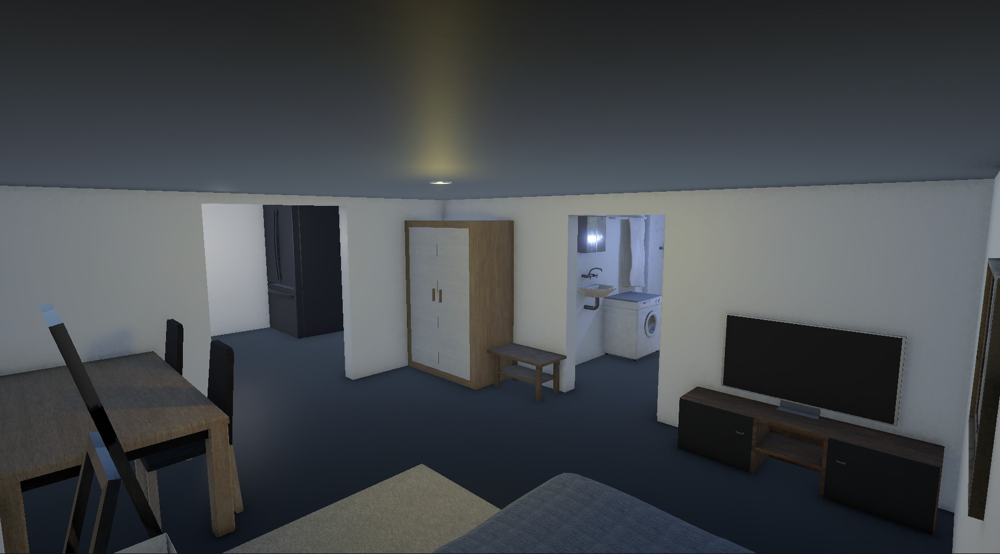
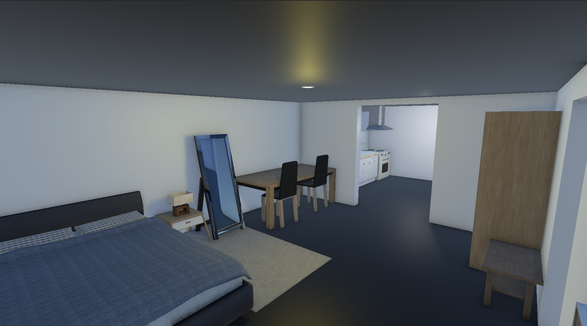

# 3D Indoor Environment – Open Kitchen Apartment

This project is a small indoor environment design created as a level design practice.

The scene represents a small apartment with an open kitchen and living room layout.

## Features
- Open kitchen layout
- Living room area
- Dining space
- Bathroom space
- Basic lighting setup
- Furniture placement

## Description
This project focuses on basic level design principles such as layout, space usage and player navigation.

## Tools
Unity / Blender

## Screenshots

